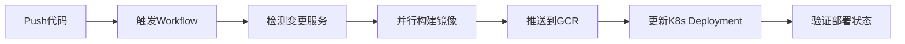

# GitHub Actions CI/CD for GKE Deployment

## 概述

本项目使用 GitHub Actions 自动化构建 Docker 镜像并部署到 Google Kubernetes Engine (GKE)。

## 前置要求

### 1. GCP 服务账号配置

创建 GCP 服务账号并授予以下权限：
- `roles/container.developer` - GKE 访问权限
- `roles/storage.admin` - GCR 镜像推送权限
- `roles/iam.serviceAccountUser` - 服务账号权限

```bash
# 创建服务账号
gcloud iam service-accounts create github-actions-sa \
  --display-name="GitHub Actions Service Account"

# 授予权限
gcloud projects add-iam-policy-binding ${PROJECT_ID} \
  --member="serviceAccount:github-actions-sa@${PROJECT_ID}.iam.gserviceaccount.com" \
  --role="roles/container.developer"

gcloud projects add-iam-policy-binding ${PROJECT_ID} \
  --member="serviceAccount:github-actions-sa@${PROJECT_ID}.iam.gserviceaccount.com" \
  --role="roles/storage.admin"

# 生成密钥文件
gcloud iam service-accounts keys create key.json \
  --iam-account=github-actions-sa@${PROJECT_ID}.iam.gserviceaccount.com
```

### 2. GitHub Secrets 配置

在 GitHub 仓库设置中配置以下 Secrets：

| Secret 名称 | 描述 | 示例值 |
|------------|------|--------|
| `GCP_SA_KEY` | GCP 服务账号 JSON 密钥（完整内容） | `{"type": "service_account",...}` |
| `GCP_PROJECT_ID` | GCP 项目 ID | `cedefi-479416` |
| `GKE_CLUSTER_NAME` | GKE 集群名称 | `cedefi-cluster-1` |
| `GKE_REGION` | GKE 集群区域（regional cluster） | `asia-east1` |

配置路径：仓库 Settings → Secrets and variables → Actions → New repository secret

### 3. GKE 集群准备

确保 GKE 集群已创建并配置好 namespaces：

```bash
# 创建 namespaces
kubectl create namespace cedefi-dev
kubectl create namespace cedefi-test
kubectl create namespace cedefi-prod

# 验证
kubectl get namespaces
```

### 4. K8s 配置文件结构

确保项目中存在以下目录结构：

```
on-chain/
├── k8s-script-dev/          # 开发环境配置
│   ├── namespace.yaml
│   ├── configmap/
│   ├── secret/
│   ├── deploy/
│   ├── service/
│   └── ingress/
├── k8s-script-test/         # 生产环境配置
│   └── ...
└── cedefi-*/                # 各服务目录
    └── Dockerfile
```

## Workflows 说明

### 1. `deploy-to-gke.yml` - 主部署流程

**触发条件：**
- Push 到 `main` 或 `dev` 分支
- 修改了服务目录或 K8s 配置
- 手动触发（workflow_dispatch）

**功能：**
- 自动检测变更的服务
- 并行构建多个服务的 Docker 镜像
- 推送到 GCR (Google Container Registry)
- 部署到对应环境的 GKE 集群

**手动触发：**
1. 进入 Actions 标签页
2. 选择 "Build and Deploy to GKE"
3. 点击 "Run workflow"
4. 选择：
   - 服务（all 或单个服务）
   - 环境（dev/test/prod）

### 2. `deploy-single-service.yml` - 单服务部署

**触发条件：** 仅手动触发

**功能：**
- 快速部署单个服务
- 支持指定镜像 tag
- 适用于紧急修复或回滚

**使用场景：**
```yaml
# 部署最新代码
service: cedefi-api
environment: dev
tag: (留空)

# 回滚到特定版本
service: cedefi-api
environment: prod
tag: prod-abc1234-20250127-123456
```

## 部署流程

### 自动部署流程



### 环境映射

| Git 分支 | 部署环境 | Namespace | K8s配置目录 |
|---------|---------|-----------|------------|
| `dev` | dev | cedefi-dev | k8s-script-dev |
| `test` | test | cedefi-test | k8s-script-test |
| `main` | prod | cedefi-prod | k8s-script-test |

## 镜像命名规范

```
gcr.io/${GCP_PROJECT_ID}/${SERVICE}:${TAG}
```

**Tag 格式：**
- `${ENV}-${SHORT_SHA}-${TIMESTAMP}` - 完整标签
  - 例如：`dev-abc1234-20250127-143022`
- `${ENV}-${SHORT_SHA}` - 短标签
  - 例如：`dev-abc1234`
- `${ENV}-latest` - 最新标签
  - 例如：`dev-latest`

## 服务列表

支持的服务及其功能：

| 服务名称 | 描述 | 端口 |
|---------|------|------|
| `cedefi-api` | 主 API 服务 | 8080 |
| `cedefi-order` | 订单服务 | 8081 |
| `cedefi-job` | 定时任务服务 | 8082 |
| `cedefi-evm-indexer` | EVM 链索引服务 | 8083 |
| `cedefi-evm-trade` | EVM 链交易服务 | 8084 |
| `cedefi-solana-indexer` | Solana 链索引服务 | 8085 |
| `cedefi-solana-trade` | Solana 链交易服务 | 8086 |
| `cedefi-solana-ticks` | Solana Ticks 服务 | 8087 |
| `cedefi-kline-compose` | K线聚合服务 | 8088 |
| `cedefi-rpc` | RPC 服务 | 8089 |

## 常见操作

### 部署新功能到开发环境

```bash
# 1. 创建功能分支
git checkout -b feature/new-api

# 2. 开发并提交代码
git add cedefi-api/
git commit -m "feat(api): add new endpoint"

# 3. 推送并合并到 dev 分支
git push origin feature/new-api
# 创建 PR 合并到 dev

# 4. 自动触发部署到 dev 环境
```

### 发布到生产环境

```bash
# 1. 从 dev 合并到 main
git checkout main
git merge dev
git push origin main

# 2. 自动触发部署到 prod 环境

# 3. 创建 Release Tag（可选）
git tag -a v1.2.3 -m "Release v1.2.3"
git push origin v1.2.3
```

### 紧急回滚

```bash
# 方式1：通过 GitHub Actions UI
# 1. 进入 Actions → Deploy Single Service
# 2. 选择服务和环境
# 3. 填入旧版本的 tag
# 4. 运行 workflow

# 方式2：通过 kubectl
kubectl rollout undo deployment/cedefi-api -n cedefi-prod

# 方式3：重新部署特定 commit
git checkout <old-commit-sha>
# 手动触发 workflow
```

### 查看部署状态

```bash
# 查看所有 Pod
kubectl get pods -n cedefi-prod

# 查看特定服务
kubectl get deployment cedefi-api -n cedefi-prod

# 查看日志
kubectl logs -f deployment/cedefi-api -n cedefi-prod

# 查看最近的事件
kubectl get events -n cedefi-prod --sort-by='.lastTimestamp'
```

### 手动构建和推送镜像

```bash
# 设置环境变量
export GCP_PROJECT_ID=your-project-id
export SERVICE=cedefi-api
export TAG=manual-v1.0.0

# 构建镜像
docker build -t gcr.io/${GCP_PROJECT_ID}/${SERVICE}:${TAG} ./${SERVICE}

# 推送镜像
docker push gcr.io/${GCP_PROJECT_ID}/${SERVICE}:${TAG}

# 更新部署
kubectl set image deployment/${SERVICE} ${SERVICE}=gcr.io/${GCP_PROJECT_ID}/${SERVICE}:${TAG} -n cedefi-prod
```

## 故障排查

### 1. 构建失败

**问题：** Docker 构建失败
```bash
# 检查 Dockerfile 语法
docker build -t test ./${SERVICE}

# 查看详细构建日志
# 在 Actions 页面展开失败的步骤
```

### 2. 推送镜像失败

**问题：** 权限不足
```bash
# 验证 GCP 服务账号权限
gcloud projects get-iam-policy ${GCP_PROJECT_ID}

# 重新生成密钥
gcloud iam service-accounts keys create new-key.json \
  --iam-account=github-actions-sa@${PROJECT_ID}.iam.gserviceaccount.com
```

### 3. 部署失败

**问题：** Pod 无法启动
```bash
# 查看 Pod 详情
kubectl describe pod <pod-name> -n cedefi-prod

# 查看日志
kubectl logs <pod-name> -n cedefi-prod

# 常见原因：
# - 镜像拉取失败（ImagePullBackOff）
# - 配置错误（CrashLoopBackOff）
# - 资源不足（Pending）
```

### 4. 连接 GKE 失败

**问题：** 无法获取集群凭证
```bash
# 验证集群信息
gcloud container clusters list

# 手动获取凭证
gcloud container clusters get-credentials ${CLUSTER_NAME} \
  --zone ${ZONE} \
  --project ${PROJECT_ID}
```

## 最佳实践

### 1. 分支策略
- `dev` - 开发分支，自动部署到开发环境
- `test` - 测试分支，部署到测试环境
- `main` - 主分支，部署到生产环境
- `feature/*` - 功能分支，本地测试
- `hotfix/*` - 紧急修复分支

### 2. 提交规范
```bash
feat(api): add user login endpoint
fix(order): resolve payment timeout issue
refactor(indexer): optimize block processing
docs(readme): update deployment guide
chore(deps): upgrade go dependencies
```

### 3. 镜像管理
- 开发环境：保留最近 10 个版本
- 生产环境：保留所有稳定版本
- 定期清理未使用的镜像

```bash
# 清理旧镜像（保留最近10个）
gcloud container images list-tags gcr.io/${PROJECT_ID}/cedefi-api \
  --limit=999 --sort-by=~TIMESTAMP \
  --format='get(digest)' | tail -n +11 | \
  xargs -I {} gcloud container images delete gcr.io/${PROJECT_ID}/cedefi-api@{} --quiet
```

### 4. 监控和告警
- 配置 GKE 监控面板
- 设置 Pod 健康检查
- 配置资源限制（CPU/Memory）
- 启用日志聚合（Cloud Logging）

### 5. 安全建议
- 定期轮换 GCP 服务账号密钥
- 使用 Workload Identity（推荐）
- 限制服务账号最小权限
- 不在代码中硬编码敏感信息
- 使用 Kubernetes Secrets 存储密钥

## 性能优化

### 1. 构建缓存
- 使用 GitHub Actions Cache
- 利用 Docker layer 缓存
- 多阶段构建减小镜像体积

### 2. 并行部署
- 独立服务并行构建
- 使用 matrix strategy
- 避免服务间依赖阻塞

### 3. 镜像优化
```dockerfile
# 使用精简基础镜像
FROM golang:1.21-alpine AS builder

# 利用构建缓存
COPY go.mod go.sum ./
RUN go mod download

# 多阶段构建
FROM alpine:latest
COPY --from=builder /app/binary /app/
```

## 相关链接

- [GitHub Actions 文档](https://docs.github.com/en/actions)
- [GKE 文档](https://cloud.google.com/kubernetes-engine/docs)
- [Kubernetes 最佳实践](https://kubernetes.io/docs/concepts/configuration/overview/)
- [Docker 构建优化](https://docs.docker.com/build/building/best-practices/)

## 支持

如有问题，请联系 DevOps 团队或在项目中创建 Issue。
