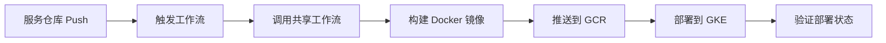

# 组织级共享工作流配置指南

## 架构说明

这个配置使用 GitHub 的**可重用工作流 (Reusable Workflows)** 功能，实现：
- `.github` 仓库：存储共享的工作流逻辑
- 各服务仓库：调用共享工作流，只需配置服务特定参数

## 文件结构

```
.github/                              # 组织配置仓库
├── workflows/
│   ├── reusable-build-deploy.yml    # ✅ 可重用工作流（核心逻辑）
│   ├── deploy-to-gke.yml            # 旧版（保留作参考）
│   └── deploy-single-service.yml    # 旧版（保留作参考）
├── workflow-templates/
│   └── service-deploy.yml           # ✅ 服务仓库工作流模板
└── scripts/
    ├── setup-gke-cicd.sh            # GCP 配置脚本
    └── setup-service-workflows.sh   # ✅ 批量配置服务仓库

cedefi-api/                           # 服务仓库示例
├── .github/
│   └── workflows/
│       └── deploy.yml               # ✅ 调用共享工作流
├── Dockerfile
└── k8s/                             # 可选：K8s 配置文件
```

## 使用步骤

### 1. 配置组织级 Secrets（推荐）

组织级 Secrets 可以被所有仓库共享：

```bash
# 使用 GitHub CLI 配置
gh secret set GCP_PROJECT_ID -b"cedefi-479416" --org cedefi-io --visibility all
gh secret set GKE_CLUSTER_NAME -b"cedefi-cluster-1" --org cedefi-io --visibility all
gh secret set GKE_REGION -b"asia-east1" --org cedefi-io --visibility all
gh secret set GCP_SA_KEY --org cedefi-io --visibility all < .github/scripts/gcp-key-20251127-140000.json
```

或者在 GitHub Web UI 配置：
- 访问：`https://github.com/organizations/cedefi-io/settings/secrets/actions`
- 点击 "New organization secret"
- 设置 visibility 为 "All repositories" 或选择特定仓库

### 2. 为各服务仓库配置工作流

**方式一：自动批量配置（推荐）**

```bash
cd /home/apt69/cedefi-projects/.github/scripts
chmod +x setup-service-workflows.sh
./setup-service-workflows.sh
```

**方式二：手动配置单个服务**

```bash
# 1. 创建工作流目录
mkdir -p cedefi-api/.github/workflows

# 2. 复制模板
cp .github/workflow-templates/service-deploy.yml cedefi-api/.github/workflows/deploy.yml

# 3. 修改服务名
sed -i 's/SERVICE_NAME_HERE/cedefi-api/g' cedefi-api/.github/workflows/deploy.yml

# 4. 提交并推送
cd cedefi-api
git add .github/workflows/deploy.yml
git commit -m "feat: add GitHub Actions deployment workflow"
git push origin main
```

### 3. 自定义服务配置（可选）

编辑服务仓库的 `.github/workflows/deploy.yml`，调整参数：

```yaml
build-and-deploy:
  uses: cedefi-io/.github/.github/workflows/reusable-build-deploy.yml@main
  with:
    service-name: cedefi-api           # 服务名
    environment: ${{ needs.determine-environment.outputs.environment }}
    dockerfile-path: ./Dockerfile      # Dockerfile 路径
    build-context: .                   # 构建上下文
    k8s-manifests-path: ./k8s/         # K8s 配置文件路径（可选）
```

## 工作流触发条件

### 自动触发
- Push 到 `main` 分支 → 部署到 `prod` 环境
- Push 到 `dev` 分支 → 部署到 `dev` 环境

### 手动触发
1. 访问服务仓库的 Actions 页面
2. 选择 "Build and Deploy" 工作流
3. 点击 "Run workflow"
4. 选择环境：dev/test/prod

## 部署流程



## Secrets 配置

### 选项 1：组织级 Secrets（推荐）
- 一次配置，所有仓库共享
- 便于统一管理和更新
- 适合多仓库环境

### 选项 2：仓库级 Secrets
如果需要不同仓库使用不同配置：

```bash
cd cedefi-api
gh secret set GCP_PROJECT_ID -b"cedefi-479416"
gh secret set GKE_CLUSTER_NAME -b"cedefi-cluster-1"
gh secret set GKE_REGION -b"asia-east1"
gh secret set GCP_SA_KEY < ../. github/scripts/gcp-key-20251127-140000.json
```

## 镜像命名规范

```
gcr.io/cedefi-479416/{service-name}:{environment}-{short-sha}-{timestamp}
```

示例：
- `gcr.io/cedefi-479416/cedefi-api:prod-abc1234-20251127-140000`
- `gcr.io/cedefi-479416/cedefi-api:dev-latest`

## 部署策略

### 1. 仅构建镜像（默认）
如果服务的 Deployment 不存在，工作流只会构建并推送镜像。

### 2. 更新现有 Deployment
如果 K8s Deployment 已存在，工作流会自动更新镜像。

### 3. 完整部署（推荐）
在服务仓库中提供 K8s 配置文件：

```bash
cedefi-api/
└── k8s/
    ├── deployment.yaml
    ├── service.yaml
    ├── configmap.yaml
    └── secret.yaml
```

然后在工作流中配置：
```yaml
k8s-manifests-path: ./k8s/
```

## 常见问题

### Q1: 工作流找不到共享工作流？
**A**: 确保 `.github` 仓库是公开的，或者组织成员有访问权限。

### Q2: 权限不足无法访问 Secrets？
**A**: 检查组织 Secrets 的 visibility 设置，确保目标仓库在白名单中。

### Q3: 如何为不同环境使用不同配置？
**A**: 使用环境变量或在 k8s 配置中使用 Kustomize overlays：
```
k8s/
├── base/
└── overlays/
    ├── dev/
    ├── test/
    └── prod/
```

### Q4: 如何回滚到之前的版本？
**A**: 
```bash
# 方式1：手动触发工作流，指定旧的镜像 tag
kubectl set image deployment/cedefi-api cedefi-api=gcr.io/cedefi-479416/cedefi-api:prod-abc1234-20251127-140000 -n cedefi

# 方式2：使用 kubectl rollout undo
kubectl rollout undo deployment/cedefi-api -n cedefi
```

## 监控和日志

### GitHub Actions
- 查看运行状态：`https://github.com/cedefi-io/{service}/actions`
- CLI: `gh run watch -R cedefi-io/{service}`

### GKE 部署状态
```bash
# 查看 Pods
kubectl get pods -n cedefi

# 查看部署历史
kubectl rollout history deployment/cedefi-api -n cedefi

# 查看日志
kubectl logs -f deployment/cedefi-api -n cedefi
```

## 最佳实践

1. **使用组织级 Secrets** - 统一管理凭证
2. **提供 K8s 配置文件** - 完整的声明式部署
3. **使用环境分支** - `dev`/`test`/`main` 分支对应不同环境
4. **配置健康检查** - 在 Deployment 中添加 liveness/readiness probes
5. **设置资源限制** - 防止资源耗尽
6. **使用 Namespace** - 环境隔离（如 `cedefi-dev`、`cedefi-prod`）

## 下一步

1. ✅ 运行配置脚本为所有服务创建工作流
2. ✅ 配置组织级 Secrets
3. ✅ 测试单个服务的部署
4. ✅ 逐步为其他服务添加工作流
5. ✅ 完善各服务的 K8s 配置文件
